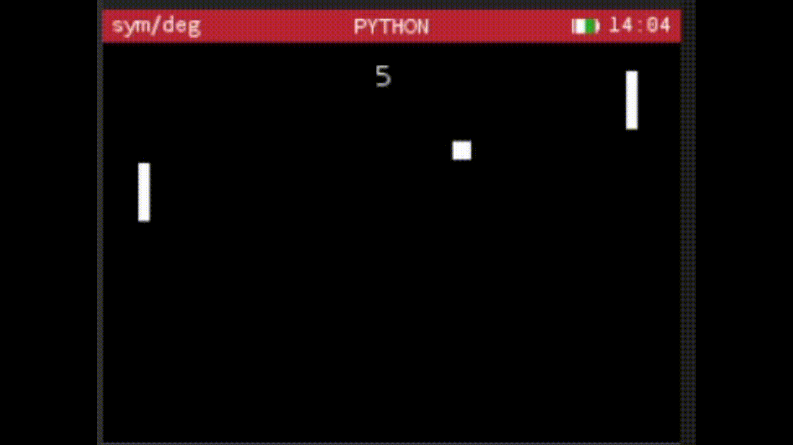
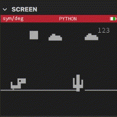
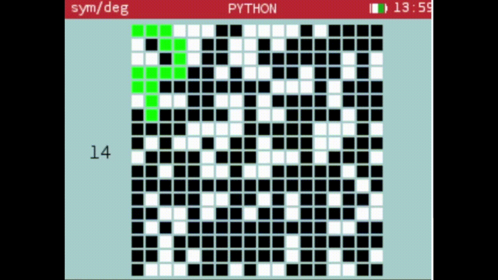

# Numworks-Python-games
Here are some games in python that I've made for the numworks

## Screenshot

## How to use them

## Author
- [DeadMall0w](https://github.com/DeadMall0w)

## License

This project is licensed under the MIT License.
